# Angular 2 纯 JavaScript 中文开发教程

**Angular 为现代设计，拥抱未来。**


在吸收了当下最先进的思想和技术后， Angular 2 框架问世，这是一个新时代，完全颠覆挥别了 AngularJS 1 平台，名字也准确定义在 **Angular** 而不再是 AngularJS。*（后文 Angular 均指代 Angular 2.X 以上版本，AngularJS 指代 Angular 1.X）*

Angular 2 带来了更先进的应用开发平台，它基于最新的 ES6 进行开发，提供移动优化，支持跨平台开发的能力，以 `Component` 组件而非 `DOM` 为核心，实现了突破性的速度与性能。包含了这一代的技术和思想顶峰。 

而 Angular 团队计划每六个月发布一个主要版本来跟进技术，与此同时官方承诺*“不会再做任何像升级到 Angular 2 一样会破坏软件生态系统的重大更改重，API 也将不会有重大更改”*，这是一个对未来技术的可靠预见。全新来过，Angular 2 是未来的先进可靠选择。

和之前不同，一个很大的变化是，Angular 主要使用 TypeScript 来开发，这一代官方目前的文档和案例都是以 TypeScript 语言为指导。

这让我想起来十几年以前使用 `JavaScript`，`JScript`，`VBScript` 在网页中写脚本的混乱年代；然后，几年以后` JavaScript` 成为互联网第一大语言，面向的方面和需要的功能越来越多，眼看一统江湖，语言的广泛使用却对应着标准实现的进展缓慢；再几年，`CoffeeScript`，`Dart`，`TypeScript` 又重新制造混乱…… 实则不过十几年，技术语言起起伏伏，分裂统一又分裂，最终为在技术面前仍像个孩子一样在探索的自己留下一些对混沌和秩序的冷静。


## 关于 JavaScript 中文开发教程

**纯 JavaScript 版本的中文开发教程。**

https://github.com/ushelp/Angular-for-javascript-turorial

由于版本生态的颠覆，以及官方缺少系统的 JavaScript 语言的应用开发指导教程，对于使用 JavaScript 语言开发 Angular 应用程序的用户来说会遇到很多的困难和问题。

**这份教程是使用纯 JavaScript 来进行 Angular 开发指导，思想内容和步骤实现上都参考了官方教程，配套完整开发步骤和案例。力求从开发流程，组件定义，结构设计上不偏颇官方主旨，提供一个标准的 Angular 开发流程和项目结构。**

同时能够发现  Angular 跨平台的野心带来了更大的责任和挑战，Angular 团队在纯 JavaScript 上的测试用例还不够全面充分，开发者在使用纯 JavaScript 应用开发中有一些已经发现的 bug，可以借助笔者的经验教训去注意规避和解决。


**不是什么？**

- 不是中文版的翻译，如寻求官方权威中文翻译，请访问官方中文网站：https://angular.cn。

- 不是 API 和组件详细使用介绍文档，Angular 开发组件的基础知识和使用请移步官网。

**是什么？**

- 是结合按步骤演进的开发案例，指导如何从零一步一步构建开发出一个纯 JavaScript 的 Angular 应用，包含完整的重构过程和理由，以及对应的源代码。

 为准备和正在 Angular 使用道路上的开发者或团队，在使用纯 JavaScript 进行 Angular 开发时，提供完整开发流程，组件定义，代码结构设计上的开发教程和经验。
 
> 欢迎交流讨论，转载请注明出处，商业用途需经许可。https://github.com/ushelp/Angular-for-javascript-turorial

## 案例说明

案例演示了构建一个应用市场的程序，包括应用列表的管理和分类管理，支持应用即时搜索。

应用市场程序覆盖了 Angular 的核心原理。包含 `Module 模块`，`Component 组件`，`Template 模板`，`Directive 指令`，`Data binding 数据绑定`，`Event 事件处理`，`Service 服务`， `Router 路由`等 Angular 核心组件，以及 `From 表单验证`，`HTTP`，`Promise 承诺`， `Observable 可观察对象`等等 Angular 实用功能。

**在线演示：**

http://easyproject.cn/angular-appstore

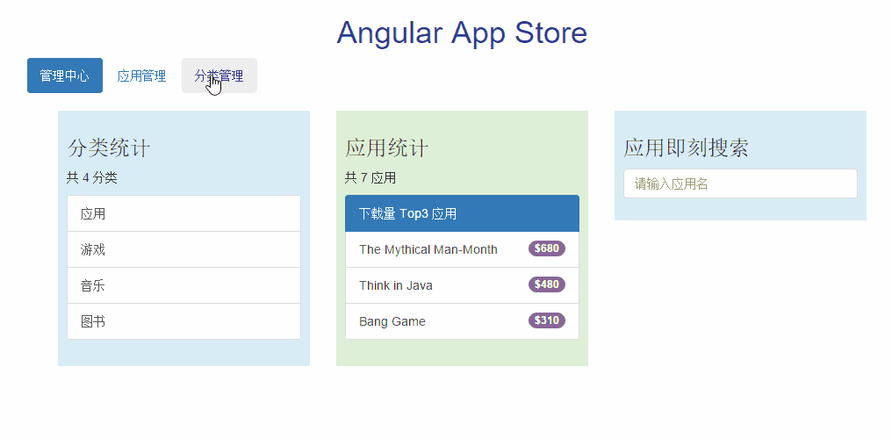

**环境要求：**

Angular 需要使用 `NodeJS 4+` 和 `npm 3+` 来构建和初始化项目。

```
# node 4.X+
node -v
# npm 3.X+
npm –v
```

**运行案例：**

所有案例均按文档步骤分类，使用 `lite-server` 开发插件直接运行，`npm start` 即可查看。

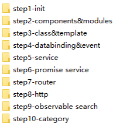

```
cd step1-init
npm intall
npm start
```

## 教程目录

[1. 初始化项目](#1-初始化项目 "1. 初始化项目")

[2. 组件和模块信息定义](#2-组件和模块信息定义 "2. 组件和模块信息定义")

[3. 类数据及模板初始化](#3-类数据及模板初始化 "3. 类数据及模板初始化")

[4. 数据绑定事件处理](#4-数据绑定事件处理 "4. 数据绑定事件处理")

[5. 服务开发](#5-服务开发 "5. 服务开发")

[6. 异步服务与承诺 Promise](#6-异步服务与承诺-promise "6. 异步服务与承诺 Promise")

[7. 使用路由构建视图导航](#7-使用路由构建视图导航 "7. 使用路由构建视图导航")

[8. HTTP 交互](#8-http-交互 "8. HTTP 交互")

[9. 使用可观察对象(Observable)即刻搜索](#9-使用可观察对象observable即刻搜索 "9. 使用可观察对象(Observable)即刻搜索")

[10. 应用分类开发实战](#10-应用分类开发实战 "10. 应用分类开发实战")


## 1. 初始化项目

实现代码：`step1-init`


### 项目基础结构

一个 Angular 项目的基础必备结构包括:

- `index.html` 应用主页面
- `app.module.js` 应用模块文件（`AppModule` 根模块）
- `app.component.js` 应用组件文件（`AppComponent` 根组件）
- `main.js` 应用引导启动文件
- `package.json` 存储项目元数据，包依赖管理使用 npm
- `bs-config.json` 配置 `lite-server` 运行信息。

根据开发指导规范，请按以上命名规范名。

### 模块化
Angular 应用都是模块化的，ES5 没有内置的模块化系统，可以使用第三方模块系统，然后我们为应用创建独立的命名空间 app，文件代码可以包裹在 `IIFE`（立即执行函数表达式）中：

```JS
// IIFE( Immediately-Invoked Function Expression )
(function(app) {


})(window.app || (window.app = {}));
```

### 项目搭建步骤

1. 搭建开发环境

	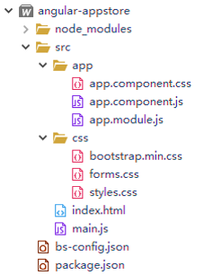

2. 配置项目元数据和服务器运行参数（`package.json`，`bs-config.json`）

	**package.json**:
	
	```JSON
	{
		"name": "angular-appstore",
		"version": "1.0.0",
		"description": "",
		"license": "MIT",
		"scripts": {
	    "start": "npm run lite",
	    "lite": "lite-server"
	  },
	  "dependencies": {
	    "@angular/common": "~2.4.7",
	    "@angular/compiler": "~2.4.7",
	    "@angular/core": "~2.4.7",
	    "@angular/forms": "~2.4.7",
	    "@angular/http": "~2.4.7",
	    "@angular/platform-browser": "~2.4.7",
	    "@angular/platform-browser-dynamic": "~2.4.7",
	    "@angular/router": "~3.4.7",
	    "@angular/upgrade": "~2.4.7",
	
	    "angular-in-memory-web-api": "~0.2.4",
	    "core-js": "^2.4.1",
	    "rxjs": "^5.1.1",
	    "zone.js": "^0.7.7"
	  },
	  "devDependencies": {
	    "concurrently": "^3.3.0",
	    "lite-server": "^2.2.2"
	  }
	}
	```
	
	**bs-config.json**:
	
	```JSON
	{
	  "server": {
	    "baseDir": "src",    
	    "routes": { 
	      "/node_modules": "node_modules"
	    }
	  }
	}
	```

3. 为 App 编写 Angular 根组件 AppComponent（`app.component.js`，`app.component.css` ）

	**Component 组件介绍**：

	- 组件用于组合程序逻辑和 HTML 模板，把数据渲染到视图 (view)。Angular 使用 Component 组件而非 DOM，是借鉴了`虚拟 DOM`（ `vue.js`） 的思想，使得页面更新的速度提高。

	**Component 组件定义语法**：
	
	```JS
	ng.core.Component({
		...
	}).Class({
		constructor:function(){
		}
		...
	});
	```

	**app.component.js**:
	
	```JS
	(function(app) {
	app.AppComponent = ng.core
		.Component({
			selector: 'appstore-app', 
			template: `
			<h1> {{title}} </h1>
			`,
			styleUrls: ['app/app.component.css']
		})
		.Class({
			constructor: function() {
				this.title="Angular App Store";
			}
		});
	})(window.app || (window.app = {}));
	```
	
	**app.component.css**:
	
	```CSS
	h1{text-align: center;}
	```

4. 添加  Angular 根模块 AppModule（`app.module.js`）

	**Module 模块介绍**：
	
	- Angular apps 应用程序由 Angular Modules 模块组成，模块包含了组件和应用程序所需的一切信息。
	
	- 模块如果需要什么东西，那就导入 (import) 它。
	
	- 每个 Angular 应用都有一个根模块类。
	
	- 对于组件很少的简单应用来说，只用一个根模块就足够了。 随着应用规模的增长，我们逐步从根模块中重构出一些特性模块，来代表一组相关功能的集合。 然后，在根模块中导入它们。

	**Module 模块定义语法**：
	
	```JS
	ng.core.NgModule({
		...
	}).Class({
		constructor:function(){
		}
		...
	});
	```

	**app.module.js**:

	```JS
	(function(app) {
	  app.AppModule =
	    // 模块定义
	    ng.core.NgModule({
	      imports: [ ng.platformBrowser.BrowserModule, ng.forms.FormsModule ], 
	      declarations: [ app.AppComponent ], // 添加 HeroFormComponent
	      bootstrap: [ app.AppComponent] // 根组件
	    })
	    .Class({
	      constructor: function() {
	      }
	    });
	})(window.app || (window.app = {}));
	```

5. 为主 Web 应用页面编写引导/启动文件（`main.js`）

	`ng.core.enableProdMode();`：在产品发布时可以启用产品模式，禁用不必要的开发检测跟踪。

    **main.js**:
    
	```JS
	(function(app) {
	  document.addEventListener('DOMContentLoaded', function() {
	  	 // 启用产品模式（ production mode）运行，禁用开发模式（development mod）
			//	ng.core.enableProdMode();
	    ng.platformBrowserDynamic
	      .platformBrowserDynamic()
	      .bootstrapModule(app.AppModule); // 启动 AppModule
	  	});
	})(window.app || (window.app = {}));
	```

6. 编写 Web 应用主页面（`index.html`）

	**index.html**:
	
	```HTML
	<!doctype html>
	<html>
		<head>
			<script>document.write('<base href="' + document.location + '" />');</script>
			<meta charset="utf-8" />
			<title>Angular AppStore</title>
			<meta name="viewport" content="width=device-width, initial-scale=1">
			<!-- CSS-->
	        <link rel="stylesheet" href="css/bootstrap.min.css">
			<link rel="stylesheet" href="css/styles.css">
			<link rel="stylesheet" href="css/forms.css">
	
			<!-- 1. Load libraries -->
			<!-- IE required polyfill -->
			<script src="node_modules/core-js/client/shim.min.js"></script>
	
			<script src="node_modules/zone.js/dist/zone.js"></script>
	
			<script src="node_modules/rxjs/bundles/Rx.js"></script>
			<script src="node_modules/@angular/core/bundles/core.umd.js"></script>
			<script src="node_modules/@angular/common/bundles/common.umd.js"></script>
			<script src="node_modules/@angular/compiler/bundles/compiler.umd.js"></script>
			<script src="node_modules/@angular/platform-browser/bundles/platform-browser.umd.js"></script>
			<script src="node_modules/@angular/platform-browser-dynamic/bundles/platform-browser-dynamic.umd.js"></script>
			<script src="node_modules/@angular/forms/bundles/forms.umd.min.js"></script>
			<script src="node_modules/@angular/router/bundles/router.umd.min.js"></script>
	
			<!-- 2. Load our 'modules' -->
			<script src='app/app.component.js'></script>
			<script src='app/app.module.js'></script> 
			<script src='main.js'></script>
	
		</head>
	
		<!-- 3. Display the application -->
		<body>
			<appstore-app>Loading...</appstore-app>
		</body>
	</html>
	```

7. 添加 CSS 样式（`bootstrap.min.css`，`forms.css`，`style.css`）
	
	**bootstrap.min.css**:

	bootstrap CSS，从 `step1-init` 获取。你也可以选择自己喜欢的样式组件，Angular 并不限制对样式组件的使用，并能很好的和这些组件一起工作。
	
	**forms.css**:
	
	定义带验证视觉效果的表单样式。
	
	```CSS
	.ng-valid[required], .ng-valid.required  {
	  border-left: 5px solid #42A948; /* green */
	}
	
	.ng-invalid:not(form)  {
	  border-left: 5px solid #a94442; /* red */
	}
	```
	
	**styles.css**:
	
	通用样式。
	
	```CSS
	h1 {
		color: #369;
		font-family: Arial, Helvetica, sans-serif;
		font-size: 250%;
	}
	
	body {
		margin: 2em;
	}
	```


## 2. 组件和模块信息定义

实现代码：`step2-components&modules`

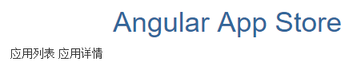

为每个管理功能创建独立的`目录`和 `Module 模块`，有利于复杂应用的开发管理。

###　开发指导规范

- 职责单一原则，每个文件只定义一样东西，每个组件单独定义文件

- 为应用中每个明显的具有多个伴随文件 (`.js`、`.html`何`.css`)的特性创建一个文件夹
	
	- 如  `app/application`，`app/application/application-detail`

- 文件命名要求 `feature.type.extension`
	- `feature 功能`：使用横杠来分隔多个单词
	
	- `type 类型`：`component`, `service`, `module`, `directive`...
	
	- `extension 扩展名`：`js`, `css`, `html`...
	
	- 如：`application-detail.component.js`

- 把组件的模板和样式提取到它们自己的文件

	- `[component-name].component.html`
	
	- `[component-name].component.css`

- 类名称与文件名一致，并添加类型后缀

	- `ApplicationComponent`：application.component.js:
	
	- `ApplicationModule`：application.module.js
	
- 在组件中只包含与视图相关的逻辑，其它逻辑都应该放到 `Service` 服务中 

	- `[component-name].service.js`

- 使用中线 (`dashed`) 或烤串 (`kebab`) 命名法来命名组件中的元素选择器

	- 正确示例：selector: '`admin-users`'

- 把组件当做元素，坚持通过选择器将组件直接定义为元素

	- 错误示例：selector: '`[admin-users]`',


### 组件和模块信息定义

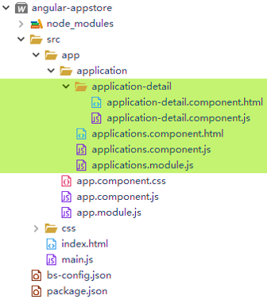

定义应用管理功能的模块和组件文件:

- 应用管理功能模块（`ApplicationModule`）

- 应用列表组件（`ApplicationsComponent`）

- 应用详情组件（`ApplicationDetailComponent`）  


为 `angular-appstore` 的应用管理功能创建一个专门的目录 `src/app/application`，存放应用管理功能的所有组件文件，并创建一个子目录 `src/app/application/application-detail` 存放应用详情组件。

### 实现步骤
	
1. 定义应用组件 ApplicationsComponent（`applications.component.js`）和相关模板文件（`applications.component.html`）

	**applications.component.js**:
	
	```JS
	(function(app) {
		app.ApplicationsComponent = ng.core
			.Component({
				selector: 'application-list',
				templateUrl: 'app/application/applications.component.html'
			})
			.Class({
				constructor: function() {
				}
			});
	})(window.app || (window.app = {}));
	```
	
	**applications.component.html**:
	
	```HTML
	应用列表
	...
	<!-- 在应用列表后此处渲染显示引用详情 -->
	<!-- `ApplicationDetailComponent` 中的模板内容会渲染到  `selector` 选择器选择的标签中。将标签定义在 `ApplicationComponent` 中 -->
	<application-detail></application-detail>
	```

2. 定义应用详情组件 ApplicationDetailComponent（`application-detail.component.js`）和相关模板文件（`application-detail.component.html`）

	**application-detail.component.js**：
	
	```JS
	(function(app) {
		app.ApplicationDetailComponent = ng.core
			.Component({
				selector: 'application-detail',
				templateUrl:'app/application/application-detail/application-detail.component.html'
			})
			.Class({
				constructor: function() {
				}
			});
	})(window.app || (window.app = {}));
	```
	
	**application-detail.component.html**：
	
	
	```HTML
	应用详情
	...
	```

3. 在 AppComponent 中定义组件显示标签

	`ApplicationsComponent` 中的模板内容会渲染到  `selector` 选择器选择的标签中。将标签定义在 `AppComponent` 中。
	
	**app.component.js**：
	
	```JS
	(function(app) {
		app.AppComponent = ng.core
			.Component({
				selector: 'appstore-app', 
				template: `
				<h1> {{title}} </h1>
				<application-list></application-list>
				`,
				styleUrls: ['app/app.component.css']
			})
			.Class({
				constructor: function() {
					this.title="Angular App Store";
				}
			});
	})(window.app || (window.app = {}));
	```

4. 在 ApplicationsModule（`applications.module.js`） 中定义和导出组件

	将之前定义的 `ApplicationsComponent` 和 `ApplicationDetailComponent` 组件在应用管理模块声明并导出。

	**applications.module.js**

	```JS
	(function(app) {
		app.ApplicationsModule = ng.core
			.NgModule({
				// 导入的模块
				imports: [ng.platformBrowser.BrowserModule, ng.forms.FormsModule],
				// 定义声明模块
				declarations: [app.ApplicationsComponent, app.ApplicationDetailComponent],
				// 导出模块
				exports: [app.ApplicationsComponent, app.ApplicationDetailComponent]
			})
			.Class({
				constructor: function() {}
			});
	})(window.app || (window.app = {}));
	```

5. 在 AppModule（`app.module.js`） 中导入开发的应用管理功能模块 ApplicationModule（`applications.module.js`）

	为每个主要功能定义独立的模块，然后在主模块中 `imports` 导入，可以使得大项目结构更加清晰有序。

	**app.module.js**

	```JS
	(function(app) {
	  app.AppModule =
	    // 模块定义
	    ng.core.NgModule({
	    	// 导入的模块
	      imports: [ ng.platformBrowser.BrowserModule, ng.forms.FormsModule, app.ApplicationsModule ], 
	      declarations: [ app.AppComponent ], 
	      bootstrap: [ app.AppComponent] 
	    })
	    .Class({
	      constructor: function() {
	      }
	    });
	})(window.app || (window.app = {}));
	```
	
6. 在 `index.html` 中引入开发的 `js` 文件

	```HTML
	<script src="app/application/applications.component.js"></script>
	<script src="app/application/application-detail/application-detail.component.js"></script>
	<script src="app/application/applications.module.js"></script>
	```
	

## 3. 类数据及模板初始化

实现代码：`step3-components&modules`

通过类，模拟数据和 HTML 模板，将效果展现出来。

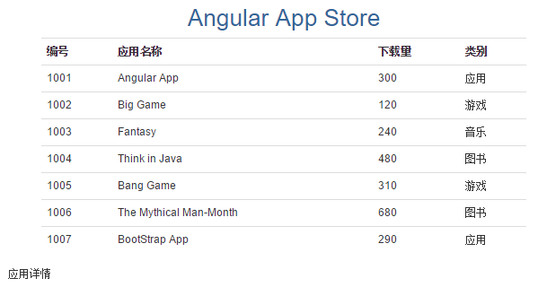

### 添加类文件

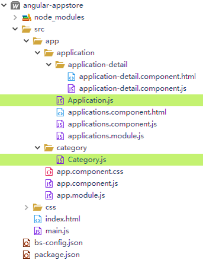

### 实现步骤

1. 创建应用类（`Application.js`），保存应用信息
	
	**Application.js**:
	
	```JS
	(function(app) {
	  app.Application = Application;
	  
	  /**
	   * 应用类
	   * @param {number} id 
	   * @param {string} name 名称
	   * @param {number} downloads 下载量
	   * @param {string} category 分类
	   */
	  function Application(id, name, downloads, category) {
	    this.id = id;
	    this.name = name;
	    this.downloads = downloads;
	    this.category = category;
	  }
	})(window.app || (window.app = {}));
	```
	
2. 创建分类类（`Category.js`），保存分类信息

	由于应用需要分类数据，在 app 目录下创建一个 `category 分类管理功能`目录，并创建 `Category.js` 类别类：
	
    **app/category/Category.js**:
	
	```JS
	(function(app) {
	  app.Category = Category;
	  
	  /**
	   * 应用类别类
	   * @param {number} id 
	   * @param {string} name 分类名称
	   */
	  function Category(id, name) {
	    this.id = id;
	    this.name = name;
	  }
	})(window.app || (window.app = {}));
	```	
	
3. 在 `index.html` 页面引入新添加的类文件

	```HTML
	<script src="app/category/Category.js"></script>
	<script src="app/application/Application.js"></script>
	```
	
4. 编写应用列表模板（`applications.component.html`）

	**applications.component.html**:

	```HTML
	<div class="container">
		<table class="table table-hover">
			<tr>
				<th>编号</th>
				<th>应用名称</th>
				<th>下载量</th>
				<th>类别</th>
			</tr>
			<tr *ngFor="let application of applications">
				<td>
					{{application.id}}
				</td>
				<td>
					{{application.name}}
				</td>
				<td>
					{{application.downloads}}
				</td>
				<td>
					{{application.category}}
				</td>
			</tr>
		</table>
	</div>
	<!-- 应用详情组件标签 -->
	<application-detail></application-detail>
	```

5. 在父组件 ApplicationsComponent 中初始化数据

	**applications.component.js**:
	
	```JS
	(function(app) {
		
		// 模拟数据
		const CATEGORYS=[
			new app.Category(1, '应用'),
			new app.Category(2, '游戏'),
			new app.Category(3, '音乐'),
			new app.Category(4, '图书')
		];
		const APPLICATIONS=[
			new app.Application(1001, 'Angular App', 300, CATEGORYS[0].name),
			new app.Application(1002, 'Big Game', 120, CATEGORYS[1].name),
			new app.Application(1003, 'Fantasy', 240, CATEGORYS[2].name),
			new app.Application(1004, 'Think in Java', 480, CATEGORYS[3].name),
			new app.Application(1005, 'Bang Game', 310, CATEGORYS[1].name),
			new app.Application(1006, 'The Mythical Man-Month', 680, CATEGORYS[3].name),
			new app.Application(1007, 'BootStrap App', 290, CATEGORYS[0].name)
		];
		
		app.ApplicationsComponent = ng.core
			.Component({
				selector: 'application-list',
				templateUrl:'app/application/applications.component.html'
			})
			.Class({
				constructor: function() {
					// 分类和应用数据列表
					this.categories = CATEGORYS;
					this.applications = APPLICATIONS;
				}
			});
	})(window.app || (window.app = {}));
	```

6. 测试


## 4. 数据绑定事件处理

实现代码：`step4-databinding&event`

通过事件处理和数据绑定，实现应用数据的增删改查。

- 在 `applications.component.html` 中增加添加数据表单

	- 编写添加数据事件处理器
	
- 处理表格数据点击事件

	- 应用选中类样式

	- 输入选中数据到 detail 详细组件

	- 显示详情组件，数据双向绑定编辑

- 实现删除

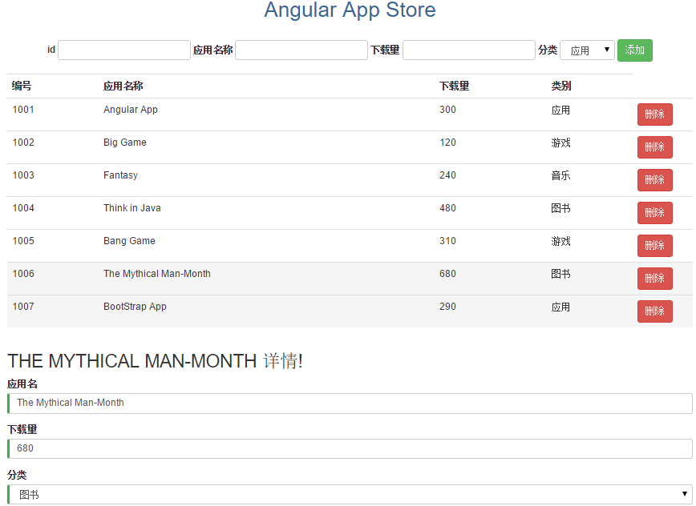


### 实现步骤


1. 修改 `applications.component.html` 模板

	增加应用信息添加表单，注册处理事件。
	
	**数据绑定 data binding**：
	
	- `{{property}}`：插值表达式。
	
	- `[property]`: 属性绑定。 
	
	- `[class.cssClassName]`: CSS class 绑定 
	
	- `(event)`：事件绑定。
	
	**指令 directive**：
	
	`*ngFor="let i of iterator"`：循环指令。
	
	`*ngIf`：判断指令
	
	`[(ngModel)]`：双向数据绑定指令

	```HTML
	<div class="container">
		<!-- 添加应用信息表单 -->
		<div style="margin: 20px auto; text-align: center;">
			<form class="form-inline" #addForm>
				<div class="form-group">
					<label for="addId">id</label>
					<input type="text" class="form-control" id="addId" name="id" required #id>
				</div>
				<div class="form-group">
					<label for="addName">应用名称</label>
					<input type="text" class="form-control" id="addName" name="name" required #name>
				</div>
				<div class="form-group">
					<label for="addDownloads">下载量</label>
					<input type="text" class="form-control" id="addDownloads" name="downloads" required #sal>
				</div>
				<div class="form-group">
					<label for="addCategory">分类</label>
					<select class="form-control" id="addCategory" name="category" #category>
					   <option *ngFor="let category of categories" [value]="category.name">{{category.name}}</option>
					</select>
				</div>
				<button type="button" class="btn btn-success" (click)="create(addForm)">添加</button>
			</form>
		</div>
		
		<!-- 列表 -->
		<table class="table table-hover">
			<tr>
				<th>编号</th>
				<th>应用名称</th>
				<th>下载量</th>
				<th>类别</th>
				<th></th>
			</tr>
			<tr *ngFor="let application of applications" [class.active]="application === selectedApplication" (click)="onSelect(application)">
				<td>
					{{application.id}}
				</td>
				<td>
					{{application.name}}
				</td>
				<td>
					{{application.downloads}}
				</td>
				<td>
					{{application.category}}
				</td>
				<td width="100">
					<button class="btn btn-danger" (click)="delete(application);$event.stopPropagation()">删除</button>
				</td>
			</tr>
		</table>
	</div>
	<!-- 从父组件传入属性值到子组件 -->
	<application-detail [categories]="categories" [selectedApplication]="selectedApplication"></application-detail>
	```
	
	- **添加应用信息表单**
	
		`#addForm`： 模板引用变量，模板引用变量能从模块中直接访问标记的元素。在处理添加事件时，将表单对象传递到事件处理器中，获得表单的值。
		
		`(click)="create(addForm)"`：注册单击事件处理器，将 `addForm` 传递到组件的 `create` 方法中去。
		
		```HTML
		<form class="form-inline" #addForm>
			<button type="button" class="btn btn-success" (click)="create(addForm)">添加</button>
		</form>
		```

	- **数据选中效果**
	
		为数据行注册了 `(click)` 单击事件，并在组件中将点击的数据保存到 `this.selectedApplication 选中数据`。
		
		当循环的数据和 `this.selectedApplication` 一致则使用 `Class 绑定` `active` 类样式。
		
		```HTML
		<tr *ngFor="let application of applications" [class.active]="application === selectedApplication" (click)="onSelect(application)">
		```
		
	- **注册删除处理事件**
		
		**$event**:
	
		绑定会通过名叫 `$event` 的事件对象传递关于此事件的信息和数据值，如果目标事件是原生 `DOM` 元素事件， `$event` 就是 `DOM 事件对象`，它有像 `target` 和 `target.value` 这样的属性。`$event.stopPropagation()` 可以阻止删除按钮的事件继续传播，防止触发选中操作。
	
		```HTML
		<button class="btn btn-danger" (click)="delete(application);$event.stopPropagation();">删除</button>
		```

	- **父子组件数据传递**
	
		当选中数据时，使用 `ApplicationDetailComponent` 组件用来显示应用详情，以便编辑。`[categories]="categories"` 和 ` [selectedApplication]="selectedApplication"` 表示将父组件的两个属性值传入向子组件（`ApplicationDetailComponent`）。
		
		**注意**：要实现父子组件的数据传递，还需要在子组件中额外使用 `inputs` 定义输入的属性名称列表。
		
		```HTML
		<application-detail [categories]="categories" [selectedApplication]="selectedApplication"></application-detail>
		```

2. 实现 ApplicationsComponent 事件处理函数

	**applications.component.js**:
	
	```JS
	(function(app) {
		
		// 模拟数据
		const CATEGORYS=[
			new app.Category(1, '应用'),
			new app.Category(2, '游戏'),
			new app.Category(3, '音乐'),
			new app.Category(4, '图书')
		];
		const APPLICATIONS=[
			new app.Application(1001, 'Angular App', 300, CATEGORYS[0].name),
			new app.Application(1002, 'Big Game', 120, CATEGORYS[1].name),
			new app.Application(1003, 'Fantasy', 240, CATEGORYS[2].name),
			new app.Application(1004, 'Think in Java', 480, CATEGORYS[3].name),
			new app.Application(1005, 'Bang Game', 310, CATEGORYS[1].name),
			new app.Application(1006, 'The Mythical Man-Month', 680, CATEGORYS[3].name),
			new app.Application(1007, 'BootStrap App', 290, CATEGORYS[0].name)
		];
		
		app.ApplicationsComponent = ng.core
			.Component({
				selector: 'application-list',
				templateUrl:'app/application/applications.component.html'
			})
			.Class({
				constructor: function() {
					// 分类和应用数据列表
					this.categories = CATEGORYS;
					this.applications = APPLICATIONS;
				},
				// 处理选中处理
				onSelect:function(application){
					this.selectedApplication=application;
				},
				// 添加
				create: function(addForm) {
					// 获得数据并验证
					var id = addForm.id.value;
					var name = addForm.name.value;
					var downloads = addForm.downloads.value;
					var category = addForm.category.value;
					if(!id.trim() || !name.trim() || !downloads.trim()) {
						return;
					}
					this.applications.push(new app.Application(id, name, downloads, category));
					addForm.reset(); // 重置添加表单
					this.selectedApplication = null;
				},
				// 删除
				delete: function(application) {
					this.applications = this.applications.filter(function(o) {
							return o !== application;
					});
					if(this.selectedApplication === application) {
						this.selectedApplication = null;
					}
				}
			});
	})(window.app || (window.app = {}));
	```

3. 编写 `application-detail.component.html` 详情模板编辑应用信息

	- ApplicationDetailComponent 子组件的 `selectedApplication` 和 `categories` 属性值从 ApplicationsComponent 父组件输入。
	
	- `*ngIf="selectedApplication"` 指令，存在选中数据则才显示详情表单。
	
	- 使用 `[(ngModel)]` 实现选中数据的双向绑定。使用 ngModel 做双向数据绑定前，得先导入 `ng.forms.FormsModule`， 加入 Angular 模块的 `imports` 列表
	
	
	- `{{selectedApplication.name | uppercase}}` : UpperCasePipe 管道将名称转换为大写。 
	
	**application-detail.component.html**: 
	
	```HTML
	<div class="container" [hidden]="submitted" *ngIf="selectedApplication">
	    <h2>{{selectedApplication.name | uppercase}} 详情!</h2>
	    <form>
	      <div class="form-group">
	        <label for="name">应用名</label>
	        <input type="text" class="form-control" id="name" name="name" required [(ngModel)]="selectedApplication.name">
	      </div>
	      <div class="form-group">
	        <label for="downloads">下载量</label>
	        <input type="text" class="form-control" id="downloads" name="downloads" required [(ngModel)]="selectedApplication.downloads">
	      </div>
	      <div class="form-group">
	        <label for="category">分类</label>
	        <select class="form-control" id="category" name="category" required [(ngModel)]="selectedApplication.category">
			    <option *ngFor="let category of categories" [value]="category.name">{{category.name}}</option>
			  </select>
	      </div>
	    </form>
	</div>
	```
	
4. 在子组件 ApplicationDetailComponent 中定义 `inputs` 接收父组件的输入

	```JS
	(function(app) {
		app.ApplicationDetailComponent = ng.core
			.Component({
				selector: 'application-detail',
				templateUrl:'app/application/application-detail/application-detail.component.html',
				// 接收父组件输入的属性
				inputs:['categories', 'selectedApplication']
			})
			.Class({
				constructor: function() {
				}
			});
	})(window.app || (window.app = {}));
	```

5. trackBy 追踪函数优化

	当更改了部分属性的数据然后刷新时， NgFor 指令会重新新建整个 DOM 列表，导致性能问题。
	
	**trackBy 追踪函数**，可以在刷新时，让 NgFor 跟踪当前每一条数据是否改变，未改变的数据 DOM 不用改变。
	
	**applications.component.html**:
	
	```HTML
	<tr *ngFor="let application of applications; trackBy:trackByApplications" [class.active]="application === selectedApplication" (click)="onSelect(application)">
			
	```
	
	**applications.component.js**:
	
	```JS
	// 通过 id 跟踪，判断数据条目是否存在，是否需要更新
	trackByApplications: function(index, application){
		return application.id;
	}
	```


## 5. 服务开发

实现代码：`step5-service`

重构数据访问代码，把它隔离到一个独立的**Service 服务**中去，让组件尽可能保持精简，专注于为视图提供支持。 在这种方式下，借助模拟服务来对组件进行单元测试也会更容易，我们可以从网络服务器，浏览器的局部存储区，模拟的数据源等获取数据。

独立的服务有利于**依赖注入（DI）**，创建一个单一的、可复用的数据服务，然后把它注入到那些需要它的组件中去。

### 创建 mock 数据源文件和 Service 文件

添加模拟数据源文件 `mock/mock-applications.js`

添加服务文件 `application.service.js`

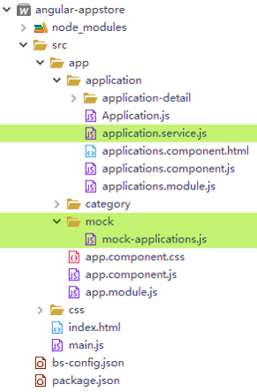

### 实现步骤

1. 创建 Mock 数据源

	**mock/mock-applications.js**:
	
	```JS
	(function(app) {
		// 模拟数据
		const CATEGORYS=[
			new app.Category(1, '应用'),
			new app.Category(2, '游戏'),
			new app.Category(3, '音乐'),
			new app.Category(4, '图书')
		];
		const APPLICATIONS=[
			new app.Application(1001, 'Angular App', 300, CATEGORYS[0].name),
			new app.Application(1002, 'Big Game', 120, CATEGORYS[1].name),
			new app.Application(1003, 'Fantasy', 240, CATEGORYS[2].name),
			new app.Application(1004, 'Think in Java', 480, CATEGORYS[3].name),
			new app.Application(1005, 'Bang Game', 310, CATEGORYS[1].name),
			new app.Application(1006, 'The Mythical Man-Month', 680, CATEGORYS[3].name),
			new app.Application(1007, 'BootStrap App', 290, CATEGORYS[0].name)
		];
		app.categories=CATEGORYS;
		app.applications=APPLICATIONS;
	})(window.app || (window.app = {}));
	```

2. 编写 ApplicationService 服务类，使用模拟数据定义提供数据的函数 
	
	**Service 服务定义语法**：
	
	```JS
	ng.core.Class({
		constructor:function(){
		}
		...
	});
	```

	**application.service.js**:
	
	```JS
	(function(app) {
		app.ApplicationService = ng.core.Class({
			constructor: function() {},
			getCategories: function() {
				return app.categories;
			},
			getApplications: function(){
				return app.applications;
			}
		});
	})(window.app || (window.app = {}));
	```

3. 在 index.html 引入 mock 数据源和 Service 服务文件

	```HTML
	<script src="app/mock/mock-applications.js"></script>
	<script src="app/application/application.service.js"></script>
	```

4. 在  AppModule 注册 ApplicationService 提供商，准备依赖注入

	- 添加可注入的 `app.ApplicationService` 类到  `AppModule` 的 `providers` 数组中。
	
	- 在 `ngModule` 而非 `ngComponent` 定义可以避免多个组件使用服务时重复创建。

	**app.module.js**:

	```
	(function(app) {
	  app.AppModule =
	    // 模块定义
	    ng.core.NgModule({
	      // 导入的模块
	      imports: [ 
		      ng.platformBrowser.BrowserModule,
		      ng.forms.FormsModule, 
		      app.ApplicationsModule
	      ],
	      declarations: [ app.AppComponent, app.DashboardComponent ], 
	      bootstrap: [ app.AppComponent],
	      // 服务提供商
		  providers: [app.ApplicationService] 
	    })
	    .Class({
	      constructor: function() {
	      }
	    });
	})(window.app || (window.app = {}));
	```

5. 在 ApplicationsComponent 通过依赖注入使用 ApplicationService

	**依赖注入的优点**：
	
	- 无需自行 new 创建对象，防止构造函数修改带来的问题
	
	- 对象可共享，有利缓存
	
	- 便于更换各种不同实现，方便测试等
	
	**依赖注入的实现**：

	- 可以通过服务和组件的构造函数进行依赖注入

	- 不要在构造函数中获取数据，构造函数仅完成参数赋值给属性
	
	- 通过 `ngOnInit` 生命周期钩子调用 Service 获得数据的方法
	
	**applications.component.js**：
	
	```JS
	...
	// 使用 ngOnInit 生命周期钩子，避免在构造函数中获取数据
	ngOnInit: function(){
		this.categories = this.service.getCategories();
		this.applications = this.service.getApplications();
	},
	// 依赖注入服务对象， 构造函数仅完成参数赋值给属性
	constructor: [app.ApplicationService, function(service) {
		// 保存服务对象
		this.service = service;
	}],
	...
	```


## 6. 异步服务与承诺 Promise

实现代码：`step6-promise service`

因为数据服务通常都是异步的，创建一个基于**承诺 (Promise)**的数据服务，可以在不改变方法签名的情况下使用异步技术。

*Promise 是异步编程的一种解决方案，是 ES6 语言标准。*


### 实现步骤

1. 修改 ApplicationService，把服务设计为返回承诺 Promise

	**application.service.js**：
	
	```JS
	(function(app) {
		app.ApplicationService = ng.core.Class({
			constructor: function() {},
			getCategories: function() {
				// 基于 Promise 承诺的服务
				return Promise.resolve(app.categories);
			},
			getApplications: function(){
				// 基于 Promise 承诺的服务
				return Promise.resolve(app.applications);
			}
		});
	})(window.app || (window.app = {}));
	```
	
2. ApplicationsComponent 组件使用基于承诺的方式获取数据

	**applications.component.js**:
	
	```JS
	// 使用 ngOnInit 生命周期钩子，避免在构造函数中获取数据
	ngOnInit: function(){
		//	this.categories = this.service.getCategories();
		//	this.applications = this.service.getApplications();
		
		// 基于承诺的行动（使用 ES2015 箭头函数）
		this.service.getCategories().then(categories=>{this.categories = categories});
		this.service.getApplications().then(applications=>{this.applications = applications});
	},
			
	```

3. 可选：模拟异步请求的延迟加载应用列表数据，进行测试

	**application.service.js**：
	
	```JS
	(function(app) {
		app.ApplicationService = ng.core.Class({
			constructor: function() {},
			getCategories: function() {
				// 基于 Promise 承诺的服务
				return Promise.resolve(app.categories);
			},
			getApplications: function(){
				// 基于 Promise 承诺的服务
				// return Promise.resolve(app.applications);
				
				// 模拟异步延迟的 Promise
				return new Promise(resolve =>
				    setTimeout(resolve, 2000)) // delay 2 seconds
				    .then(() => app.applications);
			}
		});
	})(window.app || (window.app = {}));
	```


## 7. 使用路由构建视图导航

实现代码：`step7-router`


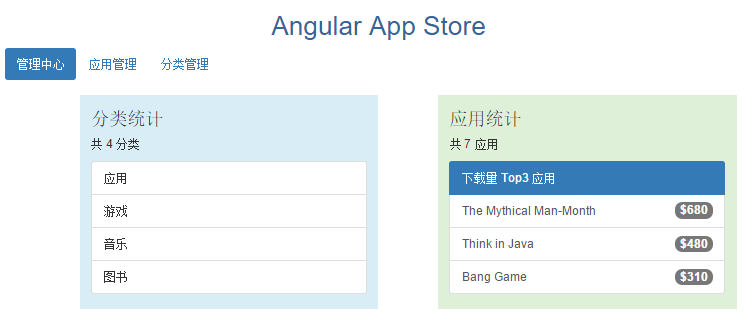


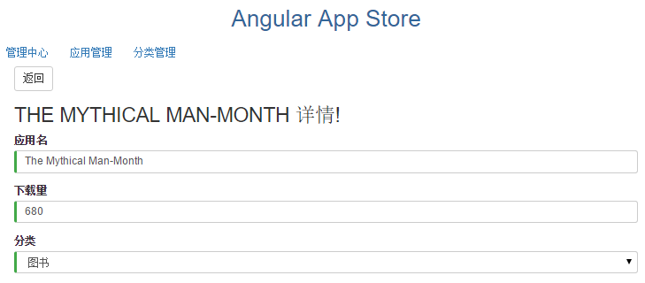


**路由**是导航的另一个名字。路由器就是从一个视图导航到另一个视图的机制。

路由告诉路由器，当用户点击链接或者把 URL 粘贴到浏览器地址栏时，应该显示哪个视图。

路由器包含了多种服务(`RouterModule`)、多种指令(`RouterOutlet`、`RouterLink`、`RouterLinkActive`)、 和一套配置(`Routes`)


### 添加路由模块文件和 Dashboard 组件

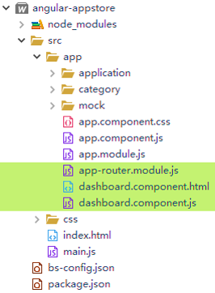

### 实现步骤

1. 创建应用路由模块 AppRouterModule，编写路由配置(`app-routing.module.js`)

	- Routes 是一个路由定义的数组。暂时只实现应用管理模块相关的导航。
	
	- `RouterModule.forRoot()` 产生一个 `Angular ModuleWithProviders`，所以这个路由类应该是一种模块类。 它应该是一个路由模块，后面将要添加到 `imports`。
	
	- 路由模块的名字应该包含 “Routing”。
	
	- 路由地址可以使用参数 `:参数名`
	

	**app-routing.module.js**：
	
	```JS
	(function(app) {
		// 配置路由
		var routes = [
			{ path: '', redirectTo: '/dashboard', pathMatch: 'full' }, // 重定向
		  	{ path: 'dashboard', component: app.DashboardComponent },
		  	{ path: 'applications', component: app.ApplicationsComponent },
		  	{ path: 'applications/:id', component: app.ApplicationDetailComponent }
		];
		
		app.AppRoutingModule = ng.router.RouterModule.forRoot(routes);
		
	})(window.app || (window.app = {}));
	```
	
2. 创建一个新的 DashboardComponent 仪表盘组件(`dashboard.component.js`)

	把 AppComponent 变成应用程序的“壳”，它只处理导航。
	
	**dashboard.component.js**：
	
	```JS
	(function(app) {
		app.DashboardComponent = ng.core
			.Component({
				selector: 'appstore-dashboard', 
				templateUrl: 'app/dashboard.component.html'
			})
			.Class({
				// 初始化 dashboard 数据
				ngOnInit: function(){
					this.title="Applications Management";
					this.service.getApplications().then(applications=>{
						// 分类数量
						this.applications=applications; 
						this.applicationCount = applications.length;
						// 下载量 Top 3
						this.sortApplications=applications.slice(0, applications.length); 
						this.sortApplications=this.sortApplications.sort(function(e1,e2){
							return e2.downloads-e1.downloads;
						}).slice(0,3);
					});
					this.service.getCategories().then(categories=>{this.categories=categories; this.categoryCount = categories.length});
				},
				constructor: [app.ApplicationService, function(service) {
					this.service=service;
				}]
			});
	})(window.app || (window.app = {}));
	```
		
3. 编写 DashboardComponent 的渲染模板文件(`dashboard.component.html`)

	显示分类数量和下载量 Top 3。

	**dashboard.component.html**：
	
	```JS
	<div class="row" style="margin: 20px;">
		<div class="col-md-1"></div>
		<div class="bg-info col-md-5">
			<h3>分类统计</h3>
			<p>共 {{categoryCount}} 分类</p>
			<ul class="list-group">
				<li class="list-group-item" *ngFor="let category of categories">
					{{category.name}}
				</li>
			</ul>
		</div>
		
		<div class="col-md-1"></div>
		<div class="bg-success col-md-5">
			<h3>应用统计</h3>
			<p>共 {{applicationCount}} 应用</p>
			<div class="list-group">
				<a href="#" class="list-group-item active">
					下载量 Top3 应用
				</a>
				<a href="#" class="list-group-item" *ngFor="let application of sortApplications" routerLink="/applications/{{application.id}}">
					{{application.name}}
					<span class="badge">${{application.downloads}}</span>
				</a>
			</div>
		</div>
	</div>
	```
	
	`routerLink="/applications/{{application.id}}"` 	实现路由导航， 告诉路由器，当用户点击这个链接时，应该导航到哪里。
	

4. 将 DashboardComponent 组件和 AppRouterModule 注册到 AppModule

	- 将 `DashboardComponent` 添加到` AppModule` 的 `declarations`
	
	- 将 `AppRouterModule` 添加到` AppModule` 的 `imports`
	
	**app.module.js**：
	
	```JS
	(function(app) {
	  app.AppModule =
	    // 模块定义
	    ng.core.NgModule({
	      // 导入的模块
	      imports: [ ng.platformBrowser.BrowserModule, ng.forms.FormsModule,app.AppRoutingModule, app.ApplicationsModule ], 
	      declarations: [ app.AppComponent, app.DashboardComponent ], 
	      bootstrap: [ app.AppComponent],
		  // 服务提供商
		  providers: [app.ApplicationService]  
	    })
	    .Class({
	      constructor: function() {
	      }
	    });
	})(window.app || (window.app = {}));
	```
	
5. 修改 AppComponent，定义导航元素（`app.component.js`）

	- 使用 `<router-outlet>` 在应用组件中显示路由激活的组件
	
	- 使用` routerLink` 导航
	
		锚标签中的 `[routerLink]` 绑定把 `RouterLink` 指令绑定到一个字符串。 告诉路由器，当用户点击这个链接时，应该导航到哪里。
	
	- 使用 `routerLinkActive` 控制当前激活导航对应的组件类样式
	
		`routerLinkActive` 路由链接激活时显示的类样式，会匹配父路径相同的路径
	
	- `[routerLinkActiveOptions]="{ exact: true }"`  仅在路由完全匹配时才应用 `routerLinkActive` 的类样式，排除匹配的父路径

	**app.component.js**：
	
	```JS
	(function(app) {
		app.AppComponent = ng.core
			.Component({
				selector: 'appstore-app', 
				// 将模板定义为应用的壳，只处理导航
				template: `
				<div class="container-fluid">
					<h1> {{title}} </h1>
					<ul class="nav nav-pills">
						  <li routerLinkActive="active" [routerLinkActiveOptions]="{ exact: true }"><a routerLink="/dashboard">管理中心</a></li>
						  <li routerLinkActive="active" [routerLinkActiveOptions]="{ exact: true }"><a routerLink="/applications">应用管理</a></li>
						  <li routerLinkActive="active" [routerLinkActiveOptions]="{ exact: true }"><a routerLink="/categories">分类管理</a></li>
						</ul>
					<router-outlet></router-outlet>
				</div>
				`,
				styleUrls: ['app/app.component.css']
			})
			.Class({
				constructor: function() {
					this.title="Angular App Store";
				}
			});
	})(window.app || (window.app = {}));
	```
	
6. 在 ApplicationService 添加根据 id 获得应用对象函数

	定义 `getApplication` 以便根据路由 id 参数的值显示应用详情时查询应用信息。

	**application.service.js**：
	
	```JS
	getApplication: function(id){
		return Promise.resolve(this.getApplications().then(applications => applications.find(application => application.id==id)));
	}
	```

7. 修改 ApplicationDetailComponent, 根据路由参数查询详情（`emp-detail.component.js`）

	- 注入 `ng.router.ActivatedRoute`，在组件中通过注入ActivatedRoute 获得路由参数值
	
	- 获得路由参数对象 `var params=this.router.params.value;`
	
	- 调用服务获得对象 `ApplicationService getApplicationService(parmas.id)` 
	
	- 注入 `ng.common.Location`，在详情页面实现返回


	**application-detail.component.html**：
	
	```HTML
	<button class="btn btn-default" (click)="goBack()">返回</button>
	```
	
	**application-detail.component.js**：
	
	```JS
	(function(app) {
		app.ApplicationDetailComponent = ng.core
			.Component({
				selector: 'application-detail',
				templateUrl:'app/application/application-detail/application-detail.component.html',
				// 接收父组件输入的属性
				inputs:['categories', 'selectedApplication']
			})
			.Class({
				// 获得路由参数，显示 id 对应的详情
				ngOnInit: function() {
					var params=this.router.params.value; // 路由参数
					this.service.getCategories().then(categories=>{this.categories = categories});
					this.service.getApplication(params.id).then(applications => this.selectedApplication = applications);
				},
				// 依赖注入 ActivatedRoute，Location
				constructor: [ng.router.ActivatedRoute, ng.common.Location, app.ApplicationService, function(router, location, service) {
					this.location=location;
					this.router=router;
					this.service=service;
				}],
				// 返回
				goBack: function() {
				 	this.location.back();
				}
			});
	})(window.app || (window.app = {}));
	```

8. 修改 index.html

	**index.html**:

	- 在  `<head>` 区顶部添加 `<base href="/">` 语句

	- 引入路由和 Dashboard 文件
	
		```HTML
		<!-- Dashboard -->
		<script src="app/dashboard.component.js"></script>
		<!-- Router 路由 -->
		<script src="app/app-routing.module.js"></script>
		```

	
9. 在 ApplicationsComponent 实现选择行时跳转到详情组件

	**applications.component.html**：
	
	`(click)="gotoDetail(application)"` 点击行时跳到详情。
	
	```JS
	<tr *ngFor="let application of applications; trackBy:trackByApplications" [class.active]="application === selectedApplication" (click)="gotoDetail(application)">
	```
	
	**applications.component.js**：
	
	注入 `ng.router.Router`，使用 `navigate` 方法请求带参数的路由
	
	```JS
	// 依赖注入服务对象， 构造函数仅完成参数赋值给属性
	constructor: [ng.router.Router, app.ApplicationService, function(router, service) {
		// 保存 Router 对象
		this.router = router;
		// 保存服务对象
		this.service = service;
	}],
	// 转到详情
	gotoDetail: function(application) {
		// 注入 ng.router.Router，使用 navigate 方法请求带参数的路由
		this.router.navigate(['/applications', application.id]);
	}
	```


## 8. HTTP 交互
	
实现代码：`step8-http`

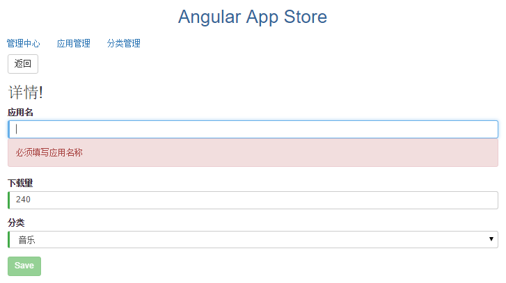

通过 `Angular HTTP` 服务和`内存 Web API` 模拟服务器开发交互和测试。

- 从服务器查询数据

- 更新数据到服务器

- 添加数据到服务器

- 删除服务器数据


### 添加内存 Web API 数据文件

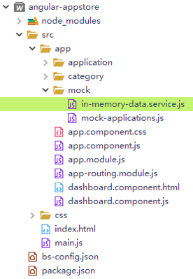


### 实现步骤

1. 定义内存 Web API 模拟服务文件

	如果暂时没有对应的 Web API 服务器，可以使用**内存 Web API** 模拟服务器开发测试。
	
	**app/mock/in-memory-data.service.js**：
	
	- 实现 `createDb` 函数定义内存数据服务。
	
	
	```JS
	(function(app) {
		app.InMemoryDataService = ng.core.Class({
			constructor: function() {},
			// CreateDb
			createDb: function() {
				var categories = [
					new app.Category(1, '应用'),
					new app.Category(2, '游戏'),
					new app.Category(3, '音乐'),
					new app.Category(4, '图书')
				];
				var applications = [
					new app.Application(1001, 'Angular App', 300, categories[0].name),
					new app.Application(1002, 'Big Game', 120, categories[1].name),
					new app.Application(1003, 'Fantasy', 240, categories[2].name),
					new app.Application(1004, 'Think in Java', 480, categories[3].name),
					new app.Application(1005, 'Bang Game', 310, categories[1].name),
					new app.Application(1006, 'The Mythical Man-Month', 680, categories[3].name),
					new app.Application(1007, 'BootStrap App', 290, categories[0].name)
				];
				return { "applications": applications, "categories": categories };
			}
		});
	})(window.app || (window.app = {}));
	```
	
2. 准备 HTTP 服务和内存 Web API 模拟服务

	**index.html**：
	
	在 `index.html` 引入模块和服务文件，注意定义顺序。
	
	```HTML
	<!-- HTTP -->
	<script src="node_modules/@angular/http/bundles/http.umd.min.js"></script>
	<!-- in-memory-web-api -->
	<script src="node_modules/angular-in-memory-web-api/bundles/in-memory-web-api.umd.js"></script>
	<!-- InMemoryDataService -->
	<script src="app/mock/in-memory-data.service.js"></script>
	```
	
	**app.module.js**：

	在` AppModule` 的 `imports` 中导入`ng.http.HttpModule` 和 `ng.inMemoryWebApi.InMemoryWebApiModule.forRoot(app.InMemoryDataService)` 模块。
	
	```JS
	(function(app) {
	  app.AppModule =
	    // 模块定义
	    ng.core.NgModule({
	      // 导入的模块
	      imports: [ 
		      ng.platformBrowser.BrowserModule,
		      ng.forms.FormsModule, 
		      app.AppRoutingModule, 
		      // HTTP
		      ng.http.HttpModule,  
		      // InMemoryWebApi
		      ng.inMemoryWebApi.InMemoryWebApiModule.forRoot(app.InMemoryDataService), 
		      app.ApplicationsModule
	      ],
	      declarations: [ app.AppComponent, app.DashboardComponent ], 
	      bootstrap: [ app.AppComponent],
		  // 服务提供商
		  providers: [app.ApplicationService]   
	    })
	    .Class({
	      constructor: function() {
	      }
	    });
	})(window.app || (window.app = {}));
	```

3. 修改 ApplicationService，使用 HTTP 请求内存 Web API 服务
		
	- 修改 `application.service.js`， 注入  `ng.http.Http`，从 `内存 Web API` 获得数据。
	
	- 删除之前的 Mock 数据文件 `mock-applications.js` 
	
	- 内存 Web API 只需掌握基本的增删改查 URL 格式即可 `:base/:collectionName/:id?`。
		
		- 查询所有(`get`)：`api/applications`
		
		- 根据 ID 查询(`get`)：`api/applications/1001`
		
		- 添加(`put`)：`api/applications`
		
		- 修改(`post`)：`api/applications/1001`
		
		- 删除(`delete`)：`api/applications/1001`
		
	- Angular 的 `http.get|post|put|delete` 会返回一个 `RxJS` 的 `Observable对象（可观察对象）`，可以通过 `.toPromise()` 转换成 Promise 对象。

	
	**application.service.js**：	
	
	```JS
	(function(app) {
		app.ApplicationService = ng.core.Class({
			constructor: function() {},
			// 注入 Http 服务
			constructor:[ ng.http.Http, function(http) {
				this.http=http;
				 // URL to web api
				this.applicationsUrl = 'api/applications';
				this.categoriesUrl = 'api/categories';
				// web api header
				this.headers = new ng.http.Headers({'Content-Type': 'application/json'});
			}],
			// 处理 HTTP 请求错误
			handleError: function(error){
				console.error('An error occurred', error); // for demo purposes only
	  			return Promise.reject(error.message || error);
			},
			// 查询分类列表
			getCategories: function() {
				// 使用 get 请求 URL 获得数据
				 return this.http.get(this.categoriesUrl)
	               .toPromise() //转换成Promise对象
	               .then(response => response.json().data) //在 then 回调中提取出数据
	               .catch(this.handleError);
			},
			// 查询应用列表
			getApplications: function(){
				// 使用 get 请求 URL 获得数据
				return this.http.get(this.applicationsUrl)
	               .toPromise() //转换成Promise对象
	               .then(response => response.json().data) //在 then 回调中提取出数据
	               .catch(this.handleError);
			},
			// 修改应用
			update: function(selectedApplication){
				// 在 URL 中的id 来告诉服务器应该更新哪个
				var url = `${this.applicationsUrl}/${selectedApplication.id}`;
		    	// 使用 put 请求 URL 修改数据
		    	// put 的 body 是该员工的 JSON 字符串，它是通过调用JSON.stringify得到的
		    	// 并且在请求头中标记出的 body 的内容类型（application/json）
			    return this.http
				    .put(url, JSON.stringify(selectedApplication), {headers: this.headers})
				    .toPromise()
				    .catch(this.handleError);
			},
			// 添加应用
			create: function(application){
				// 使用 post 请求 URL 添加数据
				return this.http
					    .post(this.applicationsUrl, JSON.stringify(application), {headers: this.headers})
					    .toPromise()
					    .then(res => res.json().data)
					    .catch(this.handleError);
			},
			delete: function(id){
				// 使用 delete 请求 URL 删除数据
				var url = `${this.applicationsUrl}/${id}`;
				return this.http
					    .delete(url, {headers: this.headers})
					    .toPromise()
					    .catch(this.handleError);
			},
			getApplication: function(id){
				// 使用 get 请求 URL 根据 id 查询数据
				var url = `${this.applicationsUrl}/${id}`;
				return this.http.get(url)
					    .toPromise()
					    .then(response => response.json().data) //在 then 回调中提取出数据
					    .catch(this.handleError);
			}
		});
	})(window.app || (window.app = {}));
	```
	
	**这里体现出了引入 Service 服务设计理念的好处。当数来源变化时，能够仅需要修改 Service 服务组件即可适应变化，其他的视图组件，模块组件都不用修改。** 
	
	你现在就可以测试更换为 HTTP 和内存 Web API 的应用是否还能正常获得数据并渲染成功。 
		
4. HTTP 交互实现：添加，删除

	现在从服务器获取数据，当执行添加，修改和删除的更新操作时，如果希望这些更改被持久化，就得把它们写回服务器。
	
	
	**applications.component.js**：
	
	使用服务器端添加和删除。
	
	```JS
	// 添加应用
	create: function(addForm) {
		// 获得数据并验证
		var id = addForm.id.value;
		var name = addForm.name.value;
		var downloads = addForm.downloads.value;
		var category = addForm.category.value;
		if(!id.trim() || !name.trim() || !downloads.trim()) {
			return;
		}
		// 由于内存 Web API 中 id 为数字，必须转换为数字保存
		this.service.create(new app.Application(parseInt(id), name, downloads, category)).then(application => {
			this.applications.push(application);
			addForm.reset(); // 重置添加表单
			this.selectedApplication = null;
		});
	},
	// 删除应用
	delete: function(application) {
		// 服务器端删除
		this.service.delete(application.id)
			.then(() => {
				// 客户端删除
				this.applications = this.applications.filter(function(o) {
					return o !== application;
				});
				if(this.selectedApplication === application) {
					this.selectedApplication = null;
				}
			});
	}
	```
	
5. HTTP 交互实现：保存修改

	
	**application-detail.component.html**
	
	在 `application-detail.component.html` 添加保存按钮，注册单击事件。
	
	```JS
	<div class="container" [hidden]="submitted" *ngIf="selectedApplication" >
		<button class="btn btn-default" (click)="goBack()">返回</button>
	    <h2>{{selectedApplication.name | uppercase}} 详情!</h2>
	    <form #applicationForm="ngForm">
	      <div class="form-group">
	        <label for="name">应用名</label>
	        <input type="text" class="form-control" id="name" name="name" required [(ngModel)]="selectedApplication.name"
	        	#name="ngModel">
	        <div [hidden]="name.valid || name.pristine" class="alert alert-danger">
	         	必须填写应用名称
	        </div>
	      </div>
	      <div class="form-group">
	        <label for="downloads">下载量</label>
	        <input type="text" class="form-control" id="downloads" name="downloads" required [(ngModel)]="selectedApplication.downloads"
	        	#downloads="ngModel">
	        <div [hidden]="downloads.valid || downloads.pristine" class="alert alert-danger">
	         	必须填写下载量
	        </div>
	      </div>
	      <div class="form-group">
	        <label for="category">分类</label>
	        <select class="form-control" id="category" name="category" required [(ngModel)]="selectedApplication.category">
			    <option *ngFor="let category of categories" [value]="category.name">{{category.name}}</option>
			  </select>
	      </div>
	       <button type="button" class="btn btn-success" [disabled]="!applicationForm.form.valid" 
	      	(click)="save()">Save</button>
	    </form>
	</div>
	```
	
	**实现表单验证**:
	
	- `#applicationForm="ngForm"` 定义验证表单变量
	
	- `#name="ngModel"` 定义验证表单元素
	
	- 借助 `ng-invalid` 类来给出有用的提示，当控件是`有效的 (valid)` 或`全新的 (pristine)` 时，隐藏消息。
	
	- 在按钮上引用表单变量，实现验证无效时按钮禁用
		
		```
		<form #applicationForm="ngForm">
			...
			<input type="text" class="form-control" id="name" name="name" required [(ngModel)]="selectedApplication.name"
	        	#name="ngModel">
	        <div [hidden]="name.valid || name.pristine" class="alert alert-danger">
	         	必须填写应用名称
	        </div>
	        ...
	        <button type="button" class="btn btn-success" [disabled]="!applicationForm.form.valid" 
	      	(click)="save()">Save</button>
	    </form>
		```
		
	**application-detail.component.js**：
	
	```JS
	// 保存修改
	save: function(){
		 this.service.update(this.selectedApplication)
		.then(() => this.goBack()); // 保存后返回上一页
	}
	```
	
6. 完成

	一个具有 HTTP 交互能力的应用就完成了。
	


## 9. 使用可观察对象(Observable)即刻搜索
	
实现代码：`step9-observable search`

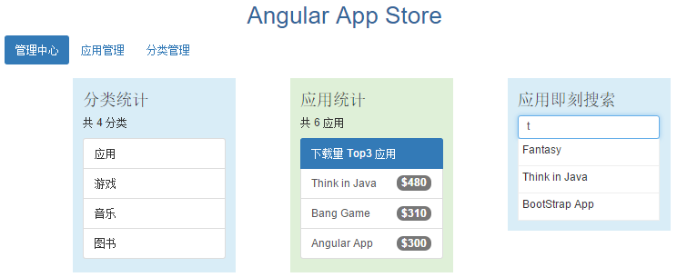

### 使用**可观察对象(Observable)** 即刻搜索

在进行及时搜索时，我们可以开始一个请求， 并且取消它，在服务器对第一个请求作出回应之前，再开始另一个不同的请求。
承诺无法实现请求的取消，对于**可观察对象(Observable)**却很简单。


### 添加搜索目录和组件

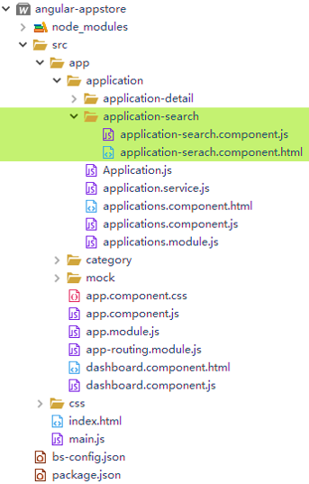


## 可观察对象(Observable)


`可观察对象（Observable）/可观察流（observable stream）`来自于 Angular 集成的 `Rx.js` 库。使用 `Reactive programming`，实现了针对异步数据流的编程的，可以合并、创建、过滤这些流。流也被称为“可观察的对象”（Observable），因为流可以被观察、订阅。

Http 服务中的每个方法都返回一个 HTTP Response 对象的 `Observable 实例`。
之前的 `ApplicationService` 将 `Observable对象`转换成了 `Promise（承诺）`，并把这个承诺返回给了调用者。 

```JS
// 查询应用列表
getApplications: function(){
	// 使用 get 请求 URL 获得数据
	return this.http.get(this.applicationsUrl)
       .toPromise() //转换成Promise对象
       .then(response => response.json().data) //在 then 回调中提取出数据
       .catch(this.handleError);
},
```

在搜索时用户不断地输入关键字，Promise 承诺无法实现请求的取消或合并，对于可观察对象却很简单。


### 实现步骤

1. 在 ApplicationService 实现 search 函数

	返回一个 `map` 转换后的 `Observable` 流对象。

	```JS
	search: function(term) {
		// 使用 name 模糊查询
		 return this.http
            .get("app/applications/?name=" + term) // Observable  流
            .map(r => r.json().data); // 将原来的流通过函数转换为新的流。转换 Observable 发出的每个项目，并返回一个 Observable
	}
	```

2. 实现 ApplicationSearchComponent 搜索组件
	
	**application-search.component.js**：
	
	```JS
	(function(app) {
		app.ApplicationSearchComponent = ng.core
			.Component({
				selector: 'application-search',
				templateUrl: 'app/application/application-search/application-serach.component.html',
				styles:[
				`.search-result{
					  border-bottom: 1px solid #eee;
					  border-left: 1px solid #eee;
					  border-right: 1px solid #eee;
					  height: 40px;
					  padding: 5px;
					  background-color: white;
					  cursor: pointer;
					}`
				]
			})
			.Class({
				// 注册流订阅
				ngOnInit: function() {
					var _this = this;
					this.applications = this.searchTerms
						// 归并请求。减轻服务器资源，减少客户流量。
						.debounceTime(300) // 获得输入后，等待超过 300ms 才实际发起请求
						.distinctUntilChanged() // 只在过滤条件变化时才发送请求， 避免重复请求同一个搜索词
						// 调用搜索服务。它会取消并丢弃以前的搜索可观察对象，只保留最近的。
						.switchMap(function(term) {
							return term // 搜索框为空时，时间返回一个空 Observable
								?
								_this.service.search(term) 
								:
								Rx.Observable.of([]);
						})
						.catch(function(error) {
							console.log(error);
							return Rx.Observable.of([]);
						});
					
				},
				constructor: [ng.router.Router, app.ApplicationService, function(router, service) {
					this.router = router;
					this.service = service;
					// Subject（主题）是一个可观察的事件流中的生产者。
					this.searchTerms = new Rx.Subject();
				}],
				// 搜索
				search: function(term) {
					// 用户输入时，调用 next 来把新的字符串放进该主题的可观察流中
					this.searchTerms.next(term);
				},
				gotoDetail: function(application) {
					this.router.navigate(['/applications', application.id]);
				}
			});
	})(window.app || (window.app = {}));
	```

	这里需要在`constructor` 构造函数中创建一个 Rx 的 `Subject（主题）` 对象，主题对象是一个可观察的事件流中的生产者：
					
	```JS
	this.searchTerms = new Rx.Subject();
	```		
	
	当用户收入搜索关键字时，通过 `next` 函数把新的字符串放入 Subject 的可观察流中，发送广播请求：
	
	```JS
	// 搜索
	search: function(term) {
		// 用户输入时，调用 next 来把新的字符串放进该主题的可观察流中
		this.searchTerms.next(term);
	}
	```
	
	在 `ngOnInit` 初始化 `applications` 属性。`Subject` 能归并请求，并把搜索词的流转换成 `Application` 对象数组的流，并把结果赋值给 `applications` 属性：
	
	通过 Subject 发送广播请求，并能归并请求，并把结果赋值给 emps 属性
	
	```JS
	// 注册流订阅
	ngOnInit: function() {
		var _this = this;
		this.applications = this.searchTerms
			// 归并请求。减轻服务器资源，减少客户流量。
			.debounceTime(300) // 获得输入后，等待超过 300ms 才实际发起请求
			.distinctUntilChanged() // 只在过滤条件变化时才发送请求， 避免重复请求同一个搜索词
			// 调用搜索服务。它会取消并丢弃以前的搜索可观察对象，只保留最近的。
			.switchMap(function(term) {
				return term // 搜索框为空时，时间返回一个空 Observable
					?
					_this.service.search(term) 
					:
					Rx.Observable.of([]);
			})
			.catch(function(error) {
				console.log(error);
				return Rx.Observable.of([]);
			});
		
	}
	```
	
	如果直接把每一次用户按键都直接传给 `ApplicationService`，就会发起一场 HTTP 请求风暴，既占用服务器资源，也会消耗移动网络的流量。
	
	通过串联一些 `Observable` 操作符，来归并这些请求。 我们将对 `ApplicationService` 发起更少的调用，并且仍然获得足够及时的响应。做法如下：

	- 在传出最终字符串之前，`debounceTime(300)` 将会等待，直到新增字符串的事件暂停了 300 毫秒。 我们实际发起请求的间隔永远不会小于 300ms。

	- `distinctUntilChanged` 确保只在过滤条件变化时才发送请求， 这样就不会重复请求同一个搜索词了。

	- `switchMap` 会为每个从 `debounce` 和 `distinctUntilChanged` 中通过的搜索词调用搜索服务。 它会取消并丢弃以前的搜索可观察对象，只保留最近的。

	- 如果搜索框为空，我们还可以短路掉这次http方法调用，并且直接返回一个包含空数组的可观察对象。

	> 注意，取消 `ApplicationService` 的可观察对象并不会实际`中止 (abort)`一个未完成的 HTTP 请求， 除非服务支持这个特性，目前我们的做法只是丢弃不希望的结果。

	- `catch` 拦截失败的可观察对象。这个简单的例子中只是把错误信息打印到控制台（但实际的应用需要做更多事），然后返回一个包含空数组的可观察对象，以清空搜索结果。
	
3. 定义搜索组件模板

	**application-serach.component.html**:
	
	```HTML
	<div class="form-group">
	  <h3>应用即刻搜索</h3>
	  <input class="form-control" #searchBox id="search-box" (keyup)="search(searchBox.value)" placeholder="请输入应用名" />
	  <div>
	  	<div *ngIf="applications">
		    <div *ngFor="let application of applications | async"
		         (click)="gotoDetail(application)" class="search-result" >
		      {{application.name}}
		    </div>
	    </div>
	  </div>
	</div>
	```
	
	
	这里必须使用 `async` 管道，订阅数据列表的 `Observable` 对象，并且为 `*ngFor` 生成数据数组。
	
	```HTML
	<div *ngFor="let application of applications | async"
		 (click)="gotoDetail(application)" class="search-result" >
	```

4. 在 ApplicationsModule 定义搜索组件信息

	在 `declarations` 和 `exports` 声明 `ApplicationSearchComponent`。
	
	**applications.module.js**:
	
	```JS
	(function(app) {
		app.ApplicationsModule = ng.core
			.NgModule({
				// 导入的模块
				imports: [ng.platformBrowser.BrowserModule, ng.forms.FormsModule],
				// 定义声明模块
				declarations: [
					app.ApplicationsComponent,
					app.ApplicationDetailComponent, 
					app.ApplicationSearchComponent // 搜索组件
				],
				// 导出模块
				exports: [
					app.ApplicationsComponent,
					app.ApplicationDetailComponent, 
					app.ApplicationSearchComponent // 搜索组件
				]
			})
			.Class({
				constructor: function() {}
			});
	})(window.app || (window.app = {}));
	```
	
5. 在 index.html 引入搜索组件
	
	**index.html**:
	
	```JS
	<!-- Search -->
	<script src="app/application/application-search/application-search.component.js"></script>
	```
	
6. 纯 JS 下的 Angular Rx bug 修改
	
	> rxjs_symbol_observable undefined Bug https://github.com/angular/angular/issues/14298
	
	在 `<script src="node_modules/rxjs/bundles/Rx.js"></script>` 后加入如下代码，避免 `rxjs_symbol_observable undefined Bug`：
	
	**index.html**:
	
	```JS
	<script src="node_modules/rxjs/bundles/Rx.js"></script>
	<-- Angular bug fixed-->
	<script>
		Rx.Symbol.$$observable = Rx.Symbol.observable;
		window.rxjs_symbol_observable = Rx.Symbol;
	</script>
	```	
	
7. 完成

	一个包含增删改查，搜索，导航的应用管理模块就开发完成了。


## 10. 应用分类开发实战

经过以上步骤的指导训练，现在可以将开发指导教程通过一个练习结合到实际的操作中，掌握常用 Angular 模块的使用，并能结合自定义组件，模块，路由，服务，数据绑定，依赖注入，HTTP 等技术和优化指导原则完成项目设计。

**动手完善应用分类管理模块：**

- 实现对分类的列表展示

- 实现对分类信息的添加，修改，删除

- 在 Dashboard 点击分类名称，跳转到应用管理界面，显示分类对应的应用。

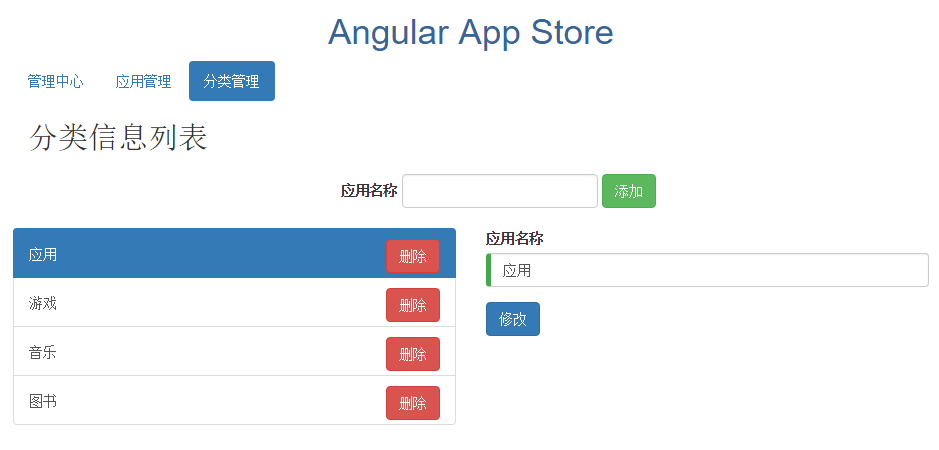

也可以参考实现代码：`step10-category`。

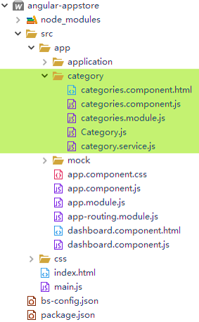
	
	
## End

Email：<inthinkcolor@gmail.com>

[http://www.easyproject.cn](http://www.easyproject.cn/angular-appstore "EasyProject Home")

[https://github.com/ushelp](https://github.com/ushelp "EasyProject GitHub")


**支付宝钱包扫一扫捐助：**

我们相信，每个人的点滴贡献，都将是推动产生更多、更好免费开源产品的一大步。

**如果您觉得有帮助，感谢慷慨捐助，以支持服务器运行和鼓励更多社区成员。**

</img>


We believe that the contribution of each bit by bit, will be driven to produce more and better free and open source products a big step.

**If you feel helpful, thank you donation to support the server running and encourage more community members.**

[](https://www.paypal.me/easyproject/10 "Make payments with PayPal - it's fast, free and secure!")


